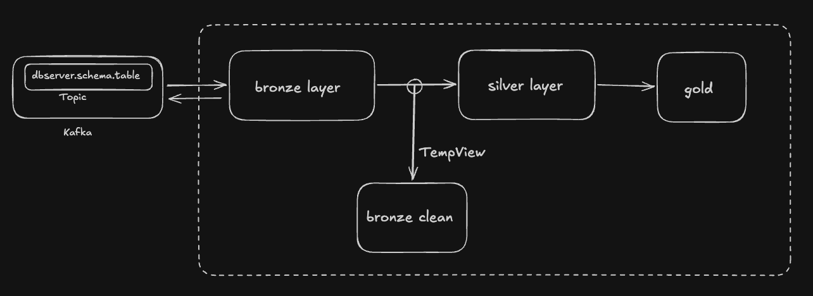

# CDC Lakehouse
This project aims to demonstrate how Apache Spark Structured Streaming can be leverage to process and merge near real time Change Data Capture (CDC) events into an optimized, transactional S3-based Lakehouse using the Delta Lake format.

## Architecture


This Lakehouse architecture follows the classic Medallion design (Bronze → Silver → Gold), entirely driven by metadata configurations and orchestrating real-time streaming pipelines.

**Bronze Layer:** The Bronze layer serves as the entry point for all raw data ingested from source systems. Data is landed "as-is" to preserve its original structure, enriched only with technical metadata (such as ingestion timestamps and process IDs). This layer is optimized for low-latency Change Data Capture (CDC), acting as an immutable historical archive that enables full data lineage, auditability, and the ability to reprocess downstream layers without re-querying the source databases.

**Silver Layer:** In the Silver layer, raw CDC events are transformed into conformed, deduplicated, and state-aware tables that represent a clean view of key business entities.
Our pipeline parses the raw nested JSON CDC envelopes into a strongly-typed schema and applies analytical window functions (ROW_NUMBER) to deduplicate multiple transactions or profile updates within the same micro-batch. Finally, an idempotent MERGE operation is executed. This process dynamically handles database updates and implements a robust soft-delete pattern: when a deletion event (op = 'd') is detected from the source, the record is flagged as inactive (is_active = false) rather than physically purged, ensuring historical consistency and auditability.

**Gold Layer:** The Gold layer is the final destination in our Lakehouse architecture. Its primary purpose is to transform cleansed, operational data from the Silver layer into highly optimized, business-oriented analytical structures.
Instead of mirroring the transactional database layout, the Gold layer models the data using a Star Schema (Dimensional Modeling) to enable fast, intuitive, and high-performance querying for BI tools and analysts.

## Project Structure
``` 
├── assets/                  # Documentation diagrams and visual assets
├── infra/                   # Containerization and local infrastructure setup
│   ├── cdc/                 # Postgres DB scripts & Kafka/Debezium Connectors
│   └── spark/               # Spark container configurations, JARs, and defaults
├── seed/                    # Mock data generator (Seeds S3/DB with initial CDC data)
├── src/                     # Core Lakehouse Pipeline Application
│   ├── common/              # Shared utilities (Spark session, writer helpers)
│   ├── configs/             # YAML settings and CDC raw schemas
│   ├── helpers/             # Custom YAML configuration parsers
│   ├── jobs/                # Batch and Streaming orchestration pipelines
│   ├── serve/               # Gold layer Dimensional Modeling (Facts & Dimensions)
│   └── transformation/      # Silver layer parsing and deduplication logic
├── docker-compose.yaml      # Multi-container local orchestration (Kafka, DB, Spark)
└── readme.md                # Project documentation
```

`infra/` - Local Environment Setup:

- `cdc/`: Packs PostgreSQL setup SQLs (init schemas and data seeds) alongside Dockerfiles for Debezium Kafka Connectors. It configures the PostgreSQL connector to stream change events.

- `spark/`: Houses configurations for our processing engine, including a customized spark-defaults.conf and all necessary connector dependency JARs (S3/AWS SDK, Delta Lake, PostgreSQL, and Kafka).

`seed/` - Mock Data Generator:

- `generator/:` Generates mock events for customers, products, and orders.

`src/` - The Medallion Pipeline:

- `common/`: Includes central helper modules like `spark_session.py` (for spawning optimal local Spark contexts) and `delta_exists.py` (which contains our smart, idempotent write_or_create writer).

- `configs/`: Standardizes execution rules via config.yaml and maps hardcoded Debezium CDC schemas (schemas.py) to parse nested JSON envelopes.

- `jobs/`: Houses the main pipeline executors. Contains separate `silver_*_pipeline.py` files to manage computing resource constraints on local machines, allowing the run of selected data scopes via CLI.

- `transformation/`: Holds the cleansing logic for the Silver layer. It converts raw JSON fields into strict columns, filters out garbage, and prepares structural updates.

- `serve/`: Houses the business-oriented transformation files for the Gold layer. It structures the cleansed data into a Star Schema (with analytical objects like dim_customers, dim_products, dim_date, and fact_orders).

- `main.py`: The central entry point of the project. It orchestrates execution, accepts CLI parameters (like --layer and --table), and triggers active streaming queries.

## How to run
Step 1: Spin up the Infrastructure
All required services—including PostgreSQL, Kafka, Zookeeper, Debezium Connect and Apache Spark via Docker.
```bash
docker compose up -d
```

Step 2: Use the data generator to continuously create, update, and delete records in the database:
```bash
docker compose --profile generator run --rm generator
```

Step 3: With the infrastructure running and data being streamed, you can now trigger the Spark Structured Streaming pipelines.
```bash
docker exec -it spark-master spark-submit src/main.py --layer all --table all
```

### Command Line Arguments
To accommodate local machine resource constraints, you can customize execution by modifying the parameters passed to the spark-submit command:

- `--layer` options: `bronze`, `silver`, `gold`, or `all`
- `--table` options: `customers`, `orders`, `products`, or `all`

**Examples:**
- Run only the Bronze ingestion layer:
```bash
docker exec -it spark-master spark-submit src/main.py --layer bronze
````

- Run the entire flow (Bronze → Gold) only for the customers table:
```bash
docker exec -it spark-master spark-submit src/main.py --layer all --table customers
```